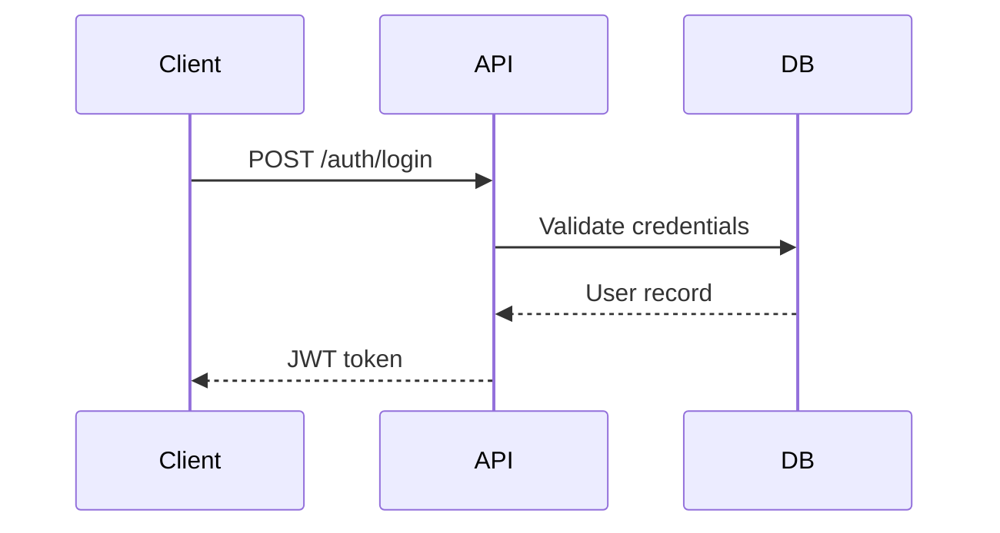

# Markdown Documentation Guidelines

## Writing Style Guidelines

**Tone:** Be direct, practical, and clear. Write in a natural, conversational and relaxed tone. Be approachable and down-to-earth with some personality, but light on the slang and excessive casual terms.

**Avoid**:

<AVOID>
- Corporate buzzwords and marketing speak
- AI-sounding language or excessive enthusiasm
- Overly formal/boring documentation style
- Dramatic hyperbole about revolutionary solutions
- Em dashes (—)
- Emojis
- Sycophancy
</AVOID>

## Core Principles

### 1. Progressive Disclosure

Reveal information in layers - essentials first, details on demand:

| Layer | Content                  | User Question        |
| ----- | ------------------------ | -------------------- |
| 1     | One-sentence description | What is it?          |
| 2     | Quick start code block   | How do I use it?     |
| 3     | Full API reference       | What are my options? |
| 4     | Architecture deep dive   | How does it work?    |

**Never bury critical information.** Warnings, breaking changes, and prerequisites go at the TOP.

### 2. Task-Oriented Writing

Write for what users want to DO:

```
<!-- ❌ Feature-oriented -->
## AuthService Class
The AuthService class provides authentication methods...

<!-- ✅ Task-oriented -->
## Authenticating Users
To authenticate a user, call login() with credentials:
```

### 3. Show, Don't Tell

Every concept needs a concrete example:

```
<!-- ❌ Abstract only -->
The retry mechanism uses exponential backoff.

<!-- ✅ With example -->
The retry mechanism uses exponential backoff:
- Attempt 1: immediate
- Attempt 2: 1s delay
- Attempt 3: 2s delay
- Attempt 4: 4s delay
```

---

## Document Templates

### README.md

````
# Project Name

One-line description of what this does.

## Quick Start

```bash
yarn install && yarn dev
```

## Installation

Step-by-step setup.

## Usage

```typescript
import { thing } from "package";
const result = thing.doSomething();
```

## Configuration

| Variable  | Required | Default | Description  |
| --------- | -------- | ------- | ------------ |
| `API_KEY` | Yes      | -       | Your API key |

## Documentation

- [API Reference](./docs/api/README.md)
- [Architecture](./docs/architecture/overview.md)

````

### API Endpoint Documentation

````

# Resource Name

Brief description.

## GET /resource

Retrieves resources.

**Parameters**

| Name    | Type   | Required | Description               |
| ------- | ------ | -------- | ------------------------- |
| `limit` | number | No       | Max results (default: 20) |

**Response**

```json
{
  "data": [...],
  "total": 100
}
```

**Example**

```typescript
const { data } = await api.get("/resource", { limit: 10 });
```

**Errors**

| Status | Code             | Description              |
| ------ | ---------------- | ------------------------ |
| 400    | `INVALID_PARAMS` | Invalid query parameters |
| 401    | `UNAUTHORIZED`   | Missing or invalid auth  |

````

---

## Example File System Organization

```
/docs
├── README.md # Docs index
├── /api
│ ├── README.md # API overview
│ ├── authentication.md
│ └── {resource}.md
├── /architecture
│ ├── overview.md
│ └── data-flow.md
├── /guides
│ ├── getting-started.md
│ └── troubleshooting.md
└── /features
└── {NNN}-{feature}.md
```

---

## Writing Standards

### Headings

- **Sentence case**: "Getting started" not "Getting Started"
- **Be specific**: "Configuring Redis" not "Configuration"
- **Max 3 levels**: H1, H2, H3 - deeper means split the doc

### Code Blocks

Always specify language:

```typescript
const config: Config = { ... };
```

Include imports when not obvious:

```
// ✅ Shows where it comes from
import { createClient } from '@redis/client';
const client = createClient();
```

### Links

Use relative paths for internal docs:

```
<!-- ✅ Portable -->
See [Authentication](./api/authentication.md)

<!-- ❌ Breaks in forks -->
See [Auth](https://github.com/org/repo/docs/api/auth.md)
```

### Tables

Use for structured data with 3+ attributes. Keep tables scannable.

### Diagrams

Use Mermaid skill `Skill(ce:visualizing-with-mermaid)` for flows:



---

## Quality Checklist

Before publishing:

- [ ] All code examples tested and runnable
- [ ] No placeholder text or TODOs
- [ ] Matches actual code behavior
- [ ] Cross-references linked
- [ ] Scannable without reading everything
- [ ] Reader knows what to do next

---

## Anti-Patterns

### Wall of Text

Break up with: headings, bullet lists, code blocks, tables.

### Buried Important Info

```
<!-- ✅ Warning first -->
> ⚠️ **Breaking Change**: v2.0 requires Node 18+

## Migration Guide
...

<!-- ❌ Hidden at bottom -->
## Migration Guide
... (500 words)
Note: Requires Node 18+
```

### Outdated Examples

Version-lock when relevant:

````

## Installation (v2.x)

```bash
yarn install package@^2.0.0
```

````

### Missing Error Documentation

Always document what can go wrong:

````

## Troubleshooting

### "Connection refused" error

**Cause**: Redis server not running

**Solution**:

```bash
docker-compose up -d redis
````

```

---

## Accessibility and Clarity

- **Avoid jargon**: Explain technical terms on first use
- **Use consistent terminology**: Pick one term and stick with it
- **Active voice**: "The function returns..." not "A value is returned..."
- **Scannable structure**: Headers, bullets, bold keywords
- **Link to prerequisites**: Don't assume knowledge
```
